# PRD-1: RevenueCat SDK 接入与课程内购


| 字段     | 内容                |
| ------ | ----------------- |
| 文档版本   | v1.2              |
| 创建日期   | 2026-04-03        |
| 文档状态   | Draft             |
| 产品负责人  | TBD               |
| 技术负责人  | TBD               |
| 设计负责人  | TBD               |
| 目标上线日期 | TBD               |
| 关联文档   | PRD-2: 存储订阅服务（后续） |


**变更记录**


| 版本   | 日期         | 变更人 | 变更说明                                                                                 |
| ---- | ---------- | --- | ------------------------------------------------------------------------------------ |
| v1.0 | 2026-04-03 | —   | 从综合 PRD 拆分，聚焦 SDK 接入 + 课程内购支付跑通                                                      |
| v1.1 | 2026-04-03 | —   | 移除独立 refund_log 表（退款事件存入 rc_webhook_events）；标注 purchase_log / F6a / F9 为可延后（MVP 非必建） |
| v1.2 | 2026-04-03 | —   | 将"我的购买"页面（F6a）、purchase_log 表、购买记录查询 API（F9）、US-104 正式移至 PRD-2                       |


**术语表**


| 术语             | 定义                                           |
| -------------- | -------------------------------------------- |
| RevenueCat     | 第三方应用内购买与订阅管理平台，提供统一 SDK 和后端 API             |
| IAP            | Apple In-App Purchase，苹果应用内购买                |
| GPB            | Google Play Billing，谷歌应用内计费                  |
| Entitlement    | 权益。用户购买产品后获得的内容访问权限                          |
| Offering       | RevenueCat 中的"产品展示方案"，可远程配置，无需发版             |
| Package        | Offering 中的"包"，每个 Package 包含一个跨平台产品          |
| Product / SKU  | App Store / Google Play 中的具体商品标识符            |
| Non-consumable | 非消耗型内购，一次购买永久拥有（如课程）                         |
| CustomerInfo   | RevenueCat SDK 返回的用户信息对象，包含该用户的全部权益状态        |
| App User ID    | RevenueCat 中标识用户的 ID，与品牌统一账号体系的 User ID 一一对应 |
| Webhook        | RevenueCat 向品牌后端推送购买/退款等事件的 HTTP 回调机制        |
| Receipt        | Apple/Google 支付成功后返回的加密凭据，用于服务端验证            |
| Sandbox        | Apple/Google 提供的测试支付环境，不产生真实扣款               |


---

## 1. 项目背景与价值

### 1.1 公司与产品现状

我们是一个面向全球市场的母婴品牌，拥有原生 + React Native 双端（iOS / Android）App。主营实体母婴产品线涵盖背带、推车、暖奶器、餐椅、音响等品类，已在 Amazon、品牌独立站、App 内多渠道销售。

近期业务战略性拓展至**数字化内容领域**：

- **已上线**：瑜伽球视频课程（1 门），售价 $50，通过 Amazon 随球赠送 + 独立站单独购买
- **规划中**：存储订阅服务（PRD-2 范畴）、未来更多数字产品品类

### 1.2 当前痛点（本 PRD 解决的）


| #   | 痛点                                                             | 影响                     |
| --- | -------------------------------------------------------------- | ---------------------- |
| P1  | **合规缺失** — App 内售卖数字产品必须遵循 Apple IAP / Google GPB 政策，当前无合规支付能力 | 无法在 App 内上架数字产品，存在下架风险 |
| P2  | **渠道碎片化** — 课程购买散落在 Amazon 赠送、独立站购买，无统一管理                      | 运营效率低，用户权益难追踪          |
| P3  | **数据孤岛** — 已售课程用户数据与 App 用户体系割裂                                | 用户体验断裂，复购率低            |
| P4  | **跨平台体验缺失** — iOS 用户购买后 Android 无法访问                           | 多设备用户流失                |


### 1.3 为什么选择 RevenueCat


| 评估维度  | RevenueCat 优势                       | 自建方案对比            |
| ----- | ----------------------------------- | ----------------- |
| 合规支付  | 原生封装 StoreKit / GPB，自动处理 Receipt 验证 | 需自行对接两套 API，维护成本高 |
| 跨平台同步 | 基于 App User ID 自动跨 iOS/Android 同步   | 需自建同步服务           |
| 数据分析  | 内置 Revenue、Dashboard                | 需自建 BI            |
| 扩展性   | 后续无缝支持订阅（PRD-2）、Stripe、A/B 测试       | 每个新功能都需开发         |
| 数据迁移  | REST API 支持 grant_promotional 批量授权  | 无标准方案             |
| 开发成本  | SDK 集成 1-2 周可上线                     | 自建预估 2-3 个月       |


### 1.4 项目价值

**对用户**：在 App 内直接购买课程，原生支付体验；跨设备登录即可访问；已有购买记录无感迁移。

**对业务**：开辟 App 内数字产品营收渠道；合规支付解除 App 上架政策风险；为后续订阅服务（PRD-2）打下技术基础。

**对技术**：统一 SDK 屏蔽 iOS/Android 支付差异；Webhook + REST API 实现后端松耦合；为 PRD-2 订阅能力做好基础设施。

### 1.5 本 PRD 与 PRD-2 的关系

```mermaid
flowchart LR
    subgraph PRD1["📘 PRD-1（本文档）"]
        A1["RevenueCat SDK 双端集成"]
        A2["后端 Webhook 基础建设"]
        A3["课程一次性购买（IAP + GPB）"]
        A4["课程权益对接（现有系统）"]
        A5["历史购买记录同步至 RC"]
        A6["数字产品商店页 + 课程详情页"]
    end
    subgraph PRD2["📗 PRD-2（后续）"]
        B1["在已有 SDK 基础上新增订阅产品"]
        B2["订阅生命周期管理"]
        B3["免费试用 + 自动续费"]
        B4["Link-out Stripe 支付"]
        B5["订阅权益由 RC 管理"]
        B6["订阅管理页面"]
        B7["购买记录页（我的购买）"]
    end
    PRD1 --"基础设施复用"--> PRD2
```


PRD-1 交付的基础设施（SDK、Webhook、用户身份体系）将被 PRD-2 完全复用。"我的购买"页面在 PRD-2 中统一规划，届时同时展示课程和订阅的购买记录。

---

## 2. 项目目标与阶段划分

### 2.1 核心目标


| 目标编号 | 目标       | 可衡量结果                                                     | 优先级 |
| ---- | -------- | --------------------------------------------------------- | --- |
| G1   | 合规支付能力   | App 内课程通过 IAP/GPB 完成合规支付，双端通过 App Store 审核                | P0  |
| G2   | SDK 基础设施 | RevenueCat SDK 双端集成 + 后端 Webhook 对接完成，为 PRD-2 订阅做好基础      | P0  |
| G3   | 课程内购跑通   | 用户可在 App 内一次性购买瑜伽球课程，支付成功后即时解锁                            | P0  |
| G4   | 课程权益对接   | IAP/GPB 购买成功后即时对接现有后端课程权益系统，零等待解锁                         | P0  |
| G5   | 多市场覆盖    | 支持 US/CA/UK/FR/DE/IT/ES/AE/SA 9 个市场本地化定价与合规               | P1  |
| G6   | 购买记录同步   | ≤100 名已付费用户历史购买记录同步至 RevenueCat Dashboard（用于数据分析，不影响权益判断） | P1  |


### 2.2 范围边界


| 包含（In Scope）                            | 不包含（Out of Scope → PRD-2）          |
| --------------------------------------- | ---------------------------------- |
| RevenueCat SDK 双端集成（iOS + Android + RN） | 存储订阅产品                             |
| 后端 Webhook 端点建设                         | 订阅生命周期管理（试用、续费、过期）                 |
| 课程一次性购买流程（IAP + GPB）                    | Link-out / Stripe 支付               |
| 课程权益对接现有后端系统                            | 订阅权益由 RC 管理                        |
| 数字产品商店页 + 课程详情页                         | 订阅方案选择页                            |
| ≤100 已购用户购买记录同步                         | 购买记录页（我的购买）→ PRD-2                 |
| 迁移用户首次登录引导                              | 订阅管理页                              |
| 9 市场本地化定价                               | Offering A/B 测试                    |
| 恢复购买功能                                  | 多语言内容本地化                           |
|                                         | 第三方 BI 集成                          |
|                                         | 自定义后台管理界面（使用 RevenueCat Dashboard） |


---

## 3. 里程碑与排期


| 里程碑 | 时间         | 主要交付物             |
| --- | ---------- | ----------------- |
| M1  | Week 1     | 前置配置 + SDK 集成     |
| M2  | Week 2     | 课程 UI + 购买流程      |
| M3  | Week 3     | 后端 Webhook + 权益对接 |
| M4  | Week 4     | 数据同步 + 迁移用户引导     |
| M5  | Week 5 - 6 | 测试 + 审核 + 上线      |


### M1: 前置配置 + SDK 集成（Week 1）


| 任务                            | 负责方          | 产出物                              | 验收标准                |
| ----------------------------- | ------------ | -------------------------------- | ------------------- |
| App Store Connect 创建课程 IAP 产品 | iOS + 运营     | Product ID                       | 审核通过                |
| Google Play Console 创建课程产品    | Android + 运营 | Product ID                       | 配置完成                |
| RevenueCat Dashboard 配置       | 技术           | Project + Entitlement + Offering | 产品关联正确              |
| iOS 原生层 SDK 初始化               | iOS          | configure + logIn 逻辑             | 启动无崩溃，User ID 正确绑定  |
| Android 原生层 SDK 初始化           | Android      | configure + logIn 逻辑             | 同上                  |
| RN 桥接层接入                      | RN           | react-native-purchases 集成        | getOfferings() 返回正确 |
| 调研现有课程权益接口                    | 后端 + 客户端     | 接口文档                             | 查询/开通/撤销接口格式、鉴权方式明确 |


### M2: 课程 UI + 购买流程（Week 2）


| 任务       | 负责方    | 产出物            | 验收标准                  |
| -------- | ------ | -------------- | --------------------- |
| 数字产品商店页  | RN     | 商店页面           | Offerings 动态加载，本地化价格  |
| 课程详情页    | RN     | 详情页面           | 含预览视频、课程大纲            |
| 一次性购买流程  | RN     | 购买全流程          | IAP/GPB 支付成功→课程权益即时开通 |
| 课程权益开通对接 | 客户端+后端 | SDK 成功→调后端开通权限 | 零等待解锁，含重试机制           |
| 购买成功/失败页 | RN     | 结果页            | 成功展示订单摘要，失败支持重试       |


### M3: 后端 Webhook + 权益对接（Week 3）


| 任务             | 负责方       | 产出物                                      | 验收标准                      |
| -------------- | --------- | ---------------------------------------- | ------------------------- |
| Webhook 接收端点   | 后端 (Java) | POST /api/v1/revenuecat/webhook          | 接收全部事件类型并正确处理             |
| 幂等处理 + 安全验证    | 后端        | event ID 去重 + Auth Header 校验             | 重复事件不重复处理，非法请求 401        |
| 购买日志同步         | 后端        | rc_webhook_events 表 + course_grant_log 表 | Webhook → 本地 DB 一致        |
| ~~购买记录查询 API~~ | ~~后端~~    | ~~GET /api/v1/user/{userId}/purchases~~  | → 移至 PRD-2（随"我的购买"页面一起规划） |
| 课程退款联动         | 后端        | REFUND Webhook → 调现有系统撤权限                | 退款后课程被锁                   |


### M4: 数据同步 + 迁移用户引导（Week 4）


| 任务         | 负责方 | 产出物                  | 验收标准                   |
| ---------- | --- | -------------------- | ---------------------- |
| 购买记录同步脚本   | 后端  | Java/Python 脚本       | 历史购买记录同步至 RC Dashboard |
| 同步验证       | QA  | 验证报告                 | RC Dashboard 数据与源数据一致  |
| 迁移用户首次登录引导 | RN  | 欢迎弹窗组件               | 迁移用户首次登录触发，仅展示一次       |
| 恢复购买功能     | RN  | Restore Purchases 按钮 | 恢复成功/无记录均有明确反馈         |


### M5: 测试 + 审核 + 上线（Week 5 - 6）


| 任务             | 负责方           | 产出物  | 验收标准              |
| -------------- | ------------- | ---- | ----------------- |
| 全流程 Sandbox 测试 | QA            | 测试报告 | 全部测试用例通过          |
| 跨平台权益验证测试      | QA            | 测试报告 | iOS↔Android 互通    |
| 性能测试           | QA            | 性能报告 | 满足 NFR 指标         |
| 双端提审           | iOS + Android | 审核版本 | 通过 App Store 审核   |
| 灰度发布           | 全员            | 灰度报告 | 按 5%→20%→50%→100% |


---

## 4. 业务流程图

### 4.1 业务模型定义

#### 4.1.1 产品类型（本 PRD 范畴）

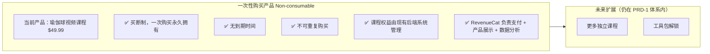


#### 4.1.2 RevenueCat 模型配置

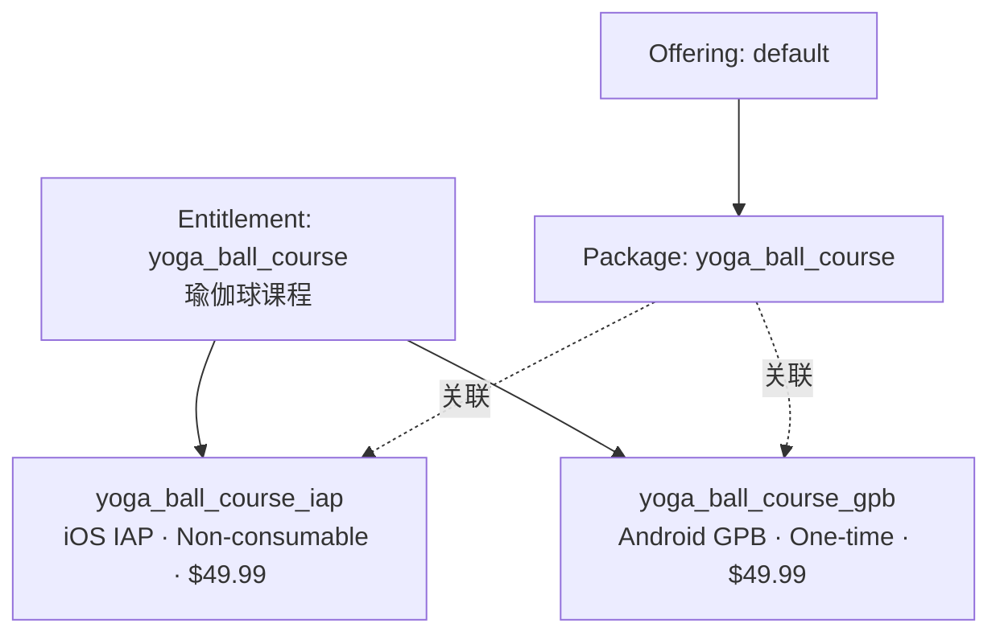


> 注：PRD-2 会新增 `storage_pro` Entitlement 和对应的 subscription Products/Packages。

#### 4.1.3 课程权益管理架构（核心架构决策）

> **关键决策**：课程权益由现有后端系统管理。RevenueCat 在课程场景中仅负责支付处理和数据分析，不作为权益判断的权威来源。

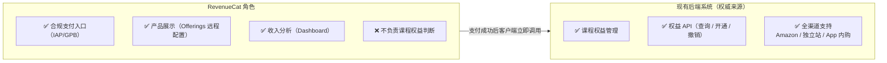


**App 内课程购买后的权益开通流程（关键链路）：**

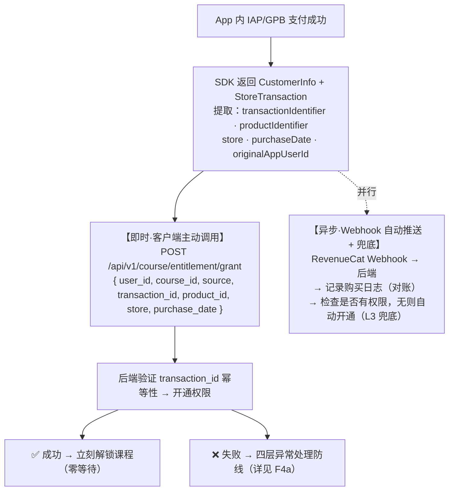


> **⚠️ 设计要点**：课程解锁主链路不依赖 Webhook，由客户端在支付成功回调中**同步**调用后端接口。异常时有四层防线兜底（即时重试 → 启动补偿 → Webhook 兜底 → 客服人工），确保已付款用户 100% 最终获得权限。详见 F4a。

### 4.2 核心业务流程

#### 4.2.1 课程一次性购买流程

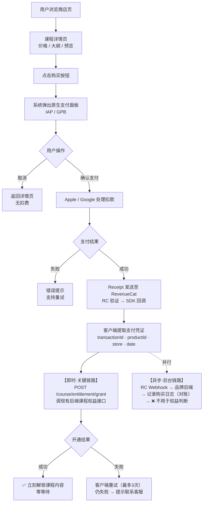


#### 4.2.2 权益验证流程

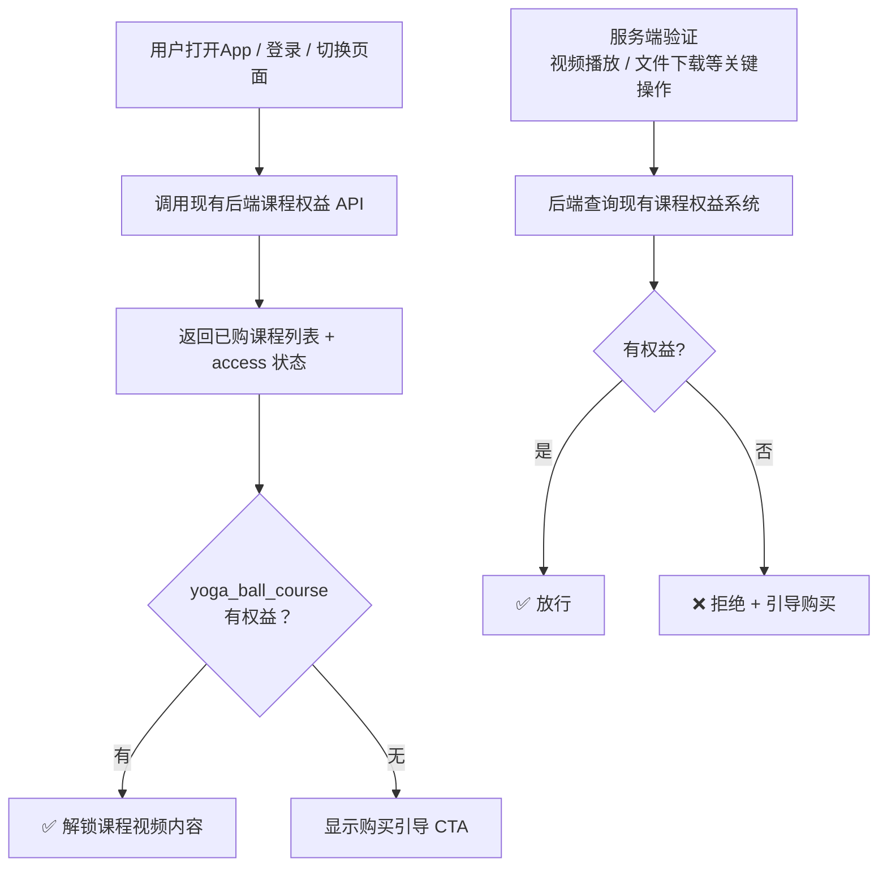


#### 4.2.3 数据同步流程（购买记录同步至 RC）

> 课程权益无需迁移（已在现有系统中）。同步的目的是让 RC Dashboard 能统计历史购买数据。优先级 P1，不阻塞上线。

```
Step 1: 数据准备
  自建数据库 → 清洗（提取已购用户、校验 user_id、去重）→ migration.csv

Step 2: 同步至 RevenueCat
  RevenueCat REST API:
  POST /v1/subscribers/{app_user_id}/entitlements/yoga_ball_course/grant_promotional
  Body: { "duration": "lifetime" }
  目的：RC Dashboard 收入统计 + 用户画像

Step 3: 验证
  1. RC Dashboard 已同步用户数量 == 源数据数量
  2. 现有课程权益系统不受影响
  3. 自建数据库标记 rc_synced = true
```

#### 4.2.4 Webhook 事件处理流程

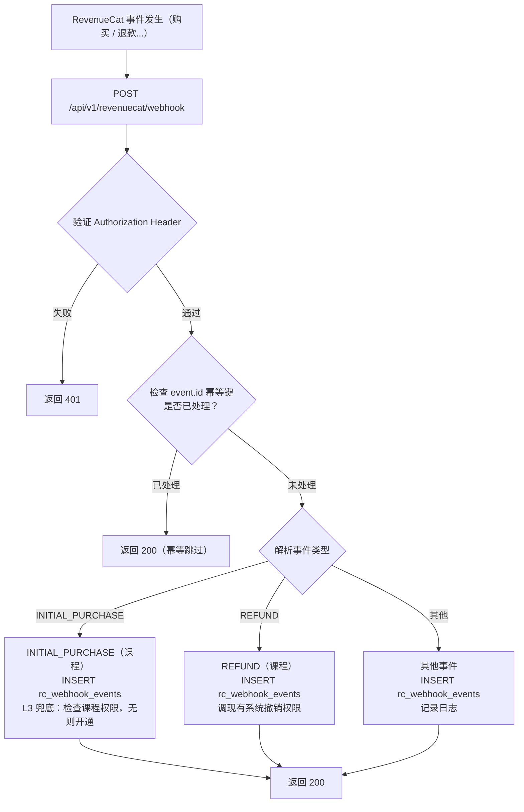


---

## 5. 用户画像与 User Story

### 5.1 用户画像

#### Persona A — 新手妈妈 Sarah（课程购买者）


| 维度   | 详情                               |
| ---- | -------------------------------- |
| 地区   | 美国加州                             |
| 年龄   | 28 岁                             |
| 设备   | iPhone 15                        |
| 场景   | 产后恢复期，在 App 中浏览实体产品时发现瑜伽球课程推荐    |
| 动机   | 希望一次性购买、随时回看                     |
| 痛点   | 担心 App 内支付安全性                    |
| 预期行为 | 浏览课程详情 → 观看预览 → 通过 IAP 购买 → 开始学习 |


#### Persona B — 已购用户 Lisa（数据迁移用户）


| 维度   | 详情                                     |
| ---- | -------------------------------------- |
| 地区   | 加拿大多伦多                                 |
| 年龄   | 30 岁                                   |
| 设备   | iPhone 14 + Android 平板                 |
| 场景   | 之前在独立站购买了瑜伽球课程，现在下载 App 希望跨设备观看        |
| 动机   | 无需重复购买，登录即可跨设备访问                       |
| 痛点   | 担心渠道切换后购买记录丢失                          |
| 预期行为 | 下载 App → 登录 → 看到课程已激活 → iPhone 和平板都能观看 |


#### Persona C — 产品运营 Kevin（内部用户）


| 维度   | 详情                                        |
| ---- | ----------------------------------------- |
| 角色   | 产品运营经理                                    |
| 场景   | 负责数字产品的上架、定价、数据分析                         |
| 动机   | 灵活配置产品和定价，查看收入数据                          |
| 痛点   | 当前无统一管理后台                                 |
| 预期行为 | 在 RevenueCat Dashboard 配置产品 → 查看数据 → 优化策略 |


### 5.2 User Stories

#### Epic 1: 课程发现与购买

**US-101: 浏览数字产品商店**

```
As a 品牌App用户
I want to 在App中浏览可购买的数字产品
So that 我可以了解有哪些数字内容可以帮助我
```

验收标准：

- 产品列表数据来源于 RevenueCat Offerings API，无需硬编码
- 每个产品展示：名称、简要描述、类型标签（"课程"）、本地化价格
- 价格根据用户设备 Locale 自动展示当地货币（USD/GBP/EUR/AED/SAR 等）
- 已购产品显示"已购买"状态徽章，隐藏购买按钮
- 支持下拉刷新产品列表
- Offerings 加载失败时展示友好错误状态 + 重试按钮

**US-102: 查看课程详情**

```
As a 对瑜伽球课程感兴趣的用户
I want to 查看课程的详细介绍、大纲和预览视频
So that 我可以在购买前充分了解课程内容
```

验收标准：

- 详情页展示：课程标题、讲师信息与头像、总时长、课时数
- 展示完整课程大纲（章节列表），锁定章节显示锁定图标
- 提供至少 1 个免费预览视频片段，可直接播放
- 底部固定购买 CTA 栏：显示价格 + "Buy Now" 按钮
- 已购用户：CTA 变为 "Start Learning"，直接进入课程播放
- 页面可被 deeplink 直达（app://course/yoga-ball）

**US-103: 一次性购买课程**

```
As a 想要购买瑜伽球课程的用户
I want to 通过Apple/Google的原生支付流程安全完成课程购买
So that 我可以立即获得课程的永久访问权
```

验收标准：

- 点击购买后通过 RevenueCat SDK 调用 purchasePackage()
- 系统弹出原生支付面板（iOS: StoreKit 面板，Android: Google Play 底部弹窗）
- 支付过程中显示 loading 状态，禁止重复点击
- 支付成功后：SDK 自动完成 Receipt 验证 → 返回成功回调
- **客户端在 SDK 成功回调中立即调用现有后端课程权益接口**，开通课程权限
- 权益开通成功 → 立刻解锁课程内容（零等待）
- 权益开通失败 → 客户端自动重试（最多 3 次），仍失败则引导用户联系客服
- 展示支付成功页：订单摘要 + "Go to Course" 按钮
- 支付取消：返回详情页，Toast 提示"购买已取消"
- 支付失败：展示错误页面，说明原因，提供"重试"按钮
- 弱网/断网：SDK 内置 Receipt 重试机制；权益开通接口失败时 App 下次启动自动补偿
- 产品类型为 Non-consumable，不可重复购买
- 同一 App User ID 下，iOS 购买后 Android 设备登录即可访问

> **US-104 查看购买记录** 已移至 PRD-2（"我的购买"页面整体在 PRD-2 规划）。

#### Epic 2: 数据迁移

**US-201: 已购用户自动获得权益**

```
As a 之前通过独立站或Amazon购买了瑜伽球课程的老用户
I want to 登录品牌App后自动拥有课程的访问权限
So that 我无需重复购买
```

验收标准：

- 已迁移用户登录 App 后，课程权益在现有后端系统中已存在，课程商店页显示"已购买"
- 课程详情页 CTA 为"Start Learning"
- 购买记录中标注来源为"Gift / Migration"
- 权益为永久有效
- 跨平台可用：iPhone 和 Android 平板均可访问

**US-202: 已购用户首次登录引导**

```
As a 从独立站迁移过来的课程用户
I want to 收到清晰的欢迎引导
So that 我能快速找到课程入口
```

验收标准：

- 用户登录 → 查询后端课程权益 API → 有权益且来源为非 App 渠道 → 本地标记未展示 → 触发引导
- 展示欢迎弹窗："Your Yoga Ball Course is ready!"
- 弹窗包含"Go to Course"直达按钮
- 弹窗仅展示一次
- 非阻塞式，用户可关闭

#### Epic 3: 权益管理

**US-301: 课程权益验证**

```
As a 已购买课程的用户
I want to 打开App后立即能访问课程
So that 体验即时、无延迟
```

验收标准：

- App 启动时调用现有后端课程权益 API 获取用户已购课程列表
- 课程区域 UI 基于后端返回的权益动态控制：解锁/锁定、CTA 文案
- 购买成功后客户端调后端接口即时开通
- 离线场景：使用客户端本地缓存的课程权益数据
- 双端权益一致：同一 User ID 在 iOS/Android 看到相同状态

**US-302: 跨平台权益同步**

```
As a 同时使用iPhone和Android设备的用户
I want to 在任一设备登录后都能访问已购课程
So that 我的购买不受设备限制
```

验收标准：

- 统一 App User ID 通过 `Purchases.logIn(appUserID)` 登录 RevenueCat
- 课程权益基于统一 user_id 查询现有后端，天然支持跨平台
- 多设备同时在线：权益状态不互斥

**US-303: 恢复购买**

```
As a 重新安装App或更换新设备的用户
I want to 一键恢复之前的购买
So that 我不会因为换机丢失已购内容
```

验收标准：

- 设置页/购买页提供"Restore Purchases"按钮
- 点击后调用 `Purchases.restorePurchases()`
- 恢复成功：Toast "Purchases restored successfully"
- 无可恢复购买：Toast "No previous purchases found"
- 恢复过程显示 loading，防止重复操作

#### Epic 4: 后台管理

**US-401: 产品配置与数据查看**

```
As a 产品运营人员
I want to 在RevenueCat Dashboard中配置课程产品并查看收入数据
So that 我可以灵活管理产品
```

验收标准：

- Dashboard 中 yoga_ball_course Entitlement 和对应 Products 配置正确
- 可查看课程购买数量、Revenue、按平台/地区拆分数据
- 可搜索用户查看权益和购买历史
- 可手动 Grant / Revoke Promotional Entitlement

---

## 6. 功能需求详述

### 6.1 功能拆分总览

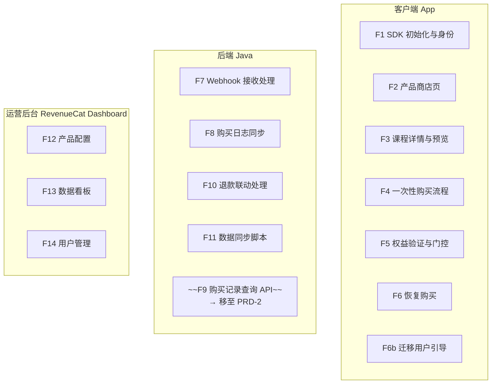


### 6.2 客户端功能详述

#### F1: SDK 初始化与用户身份管理

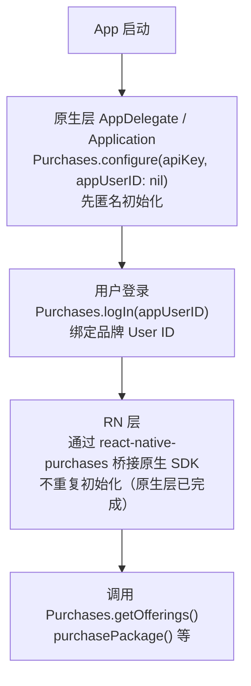


| 场景             | 处理方式                           |
| -------------- | ------------------------------ |
| App 冷启动（未登录）   | SDK 匿名初始化，生成 $RCAnonymousID    |
| 用户登录           | 调用 logIn(appUserID)，合并匿名期间的购买  |
| 用户登出           | 调用 logOut()，恢复为匿名状态            |
| 切换账号           | logOut() → logIn(newAppUserID) |
| App User ID 格式 | 使用品牌统一用户 ID，确保全局唯一             |


**双端 SDK 版本要求：**


| 平台             | SDK                    | 最低版本                  |
| -------------- | ---------------------- | --------------------- |
| iOS Native     | purchases-ios          | ≥ 4.x (StoreKit 2 支持) |
| Android Native | purchases-android      | ≥ 7.x                 |
| React Native   | react-native-purchases | ≥ 7.x                 |


#### F2: 数字产品商店页

数据来源：RevenueCat Offerings API

```
┌──────────────────────────────────┐
│         Digital Products         │
│                                  │
│  ┌────────────────────────────┐  │
│  │  🎥  YOGA BALL COURSE     │  │
│  │                            │  │
│  │  Prenatal & Postnatal      │  │
│  │  Yoga Ball Workout         │  │
│  │                            │  │
│  │  $49.99        [Buy Now]   │  │
│  │  or: [已购买 ✓]            │  │
│  └────────────────────────────┘  │
│                                  │
│  ┌────────────────────────────┐  │
│  │  ☁️  STORAGE PRO           │  │
│  │  (Coming Soon)             │  │
│  │                            │  │
│  │  Cloud storage for your    │  │
│  │  precious moments          │  │
│  │                            │  │
│  │  [Coming Soon]             │  │
│  └────────────────────────────┘  │
└──────────────────────────────────┘
```

> 存储订阅在 PRD-1 阶段展示为"Coming Soon"占位，PRD-2 上线后替换为真实订阅入口。


| 异常场景           | 处理方式                |
| -------------- | ------------------- |
| Offerings 加载失败 | 展示错误占位 + "Retry" 按钮 |
| Offerings 为空   | 展示"Coming Soon"占位   |
| 价格为 nil        | 不展示该产品              |
| 网络超时           | 5 秒超时后展示缓存数据（如有）    |


#### F3: 课程详情页


| 区域          | 内容                                 | 数据来源           |
| ----------- | ---------------------------------- | -------------- |
| Header      | 课程封面图 + 标题 + 讲师头像与名称               | CMS / 本地配置     |
| Stats Bar   | 总时长、课时数、评分                         | 本地配置           |
| Description | 课程详细描述、适合人群                        | CMS            |
| Curriculum  | 课程大纲列表（章节 + 时长），免费章节可播放，锁定章节显示锁定图标 | CMS            |
| Preview     | 免费预览视频                             | Video CDN      |
| CTA Bar     | 固定底部：价格 + 购买按钮 / "Start Learning"  | RevenueCat SDK |


#### F4: 一次性购买流程

**Step 1: 发起购买**

客户端调用 RevenueCat SDK：

```
const { customerInfo } = await Purchases.purchasePackage(coursePackage);
```

**Step 2: SDK 成功回调 — 客户端拿到的支付凭证**

`purchasePackage()` 成功后，SDK 返回 `CustomerInfo` 对象和 `StoreTransaction` 对象。客户端从中提取以下关键字段作为支付凭证：

```
// SDK 成功回调中可获取的字段
{
  // --- 来自 StoreTransaction（交易凭证） ---
  transactionIdentifier: "1000000987654321"  // Apple/Google 交易 ID（唯一标识这笔支付）
  productIdentifier:     "yoga_ball_course_iap"  // 产品 SKU
  purchaseDate:          "2026-04-03T10:30:00Z"  // 购买时间

  // --- 来自 CustomerInfo（用户权益快照） ---
  customerInfo.originalAppUserId:  "user_abc123"  // RC 中的用户 ID
  customerInfo.entitlements.active["yoga_ball_course"]: {
      isActive:           true
      productIdentifier:  "yoga_ball_course_iap"
      store:              "APP_STORE" / "PLAY_STORE"
      originalPurchaseDate: "2026-04-03T10:30:00Z"
  }
}
```


| 字段                                        | 来源               | 作用                            |
| ----------------------------------------- | ---------------- | ----------------------------- |
| `transactionIdentifier`                   | StoreTransaction | 支付交易唯一凭证，后端可用于防重放和对账          |
| `productIdentifier`                       | StoreTransaction | 确认购买的是哪个产品 SKU                |
| `purchaseDate`                            | StoreTransaction | 购买时间                          |
| `store`                                   | CustomerInfo     | 判断来自 App Store 还是 Google Play |
| `entitlements.active["yoga_ball_course"]` | CustomerInfo     | 确认 RC 已成功验证 Receipt 并授予了权益    |


**Step 3: 客户端用支付凭证请求后端开通课程权限**

```
// 支付成功后，立即调用现有后端接口
POST /api/v1/course/entitlement/grant
Authorization: Bearer {user_jwt_token}

Request Body:
{
  "user_id":          "user_abc123",
  "course_id":        "yoga_ball_course",
  "source":           "iap",           // iap | gpb（标识支付渠道）
  "transaction_id":   "1000000987654321",  // Apple/Google 交易 ID
  "product_id":       "yoga_ball_course_iap",  // SKU
  "store":            "APP_STORE",     // APP_STORE | PLAY_STORE
  "purchase_date":    "2026-04-03T10:30:00Z"
}

Response (成功):
{
  "success": true,
  "course_access": {
    "course_id": "yoga_ball_course",
    "has_access": true,
    "granted_at": "2026-04-03T10:30:01Z",
    "source": "iap"
  }
}
```

后端收到请求后：

1. 验证 `user_id` 与 JWT 身份一致
2. 验证 `transaction_id` 未被使用过（防重放）
3. 在现有课程权益系统中为该用户开通权限
4. 返回成功 → 客户端立刻解锁课程

**Step 4: 完整状态流转**

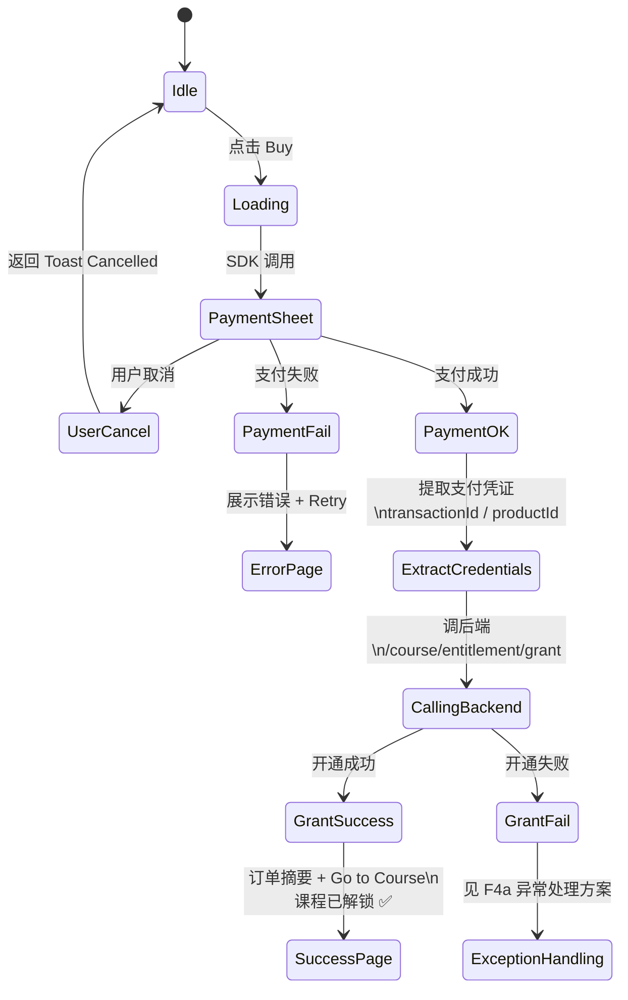


#### F4a: 课程权益开通异常处理方案（关键）

> 核心矛盾：IAP/GPB **支付已成功**（Apple/Google 已扣款），但调后端开通权限**可能失败**。此时用户已付款，必须确保最终能访问课程。

**异常处理四层防线：**

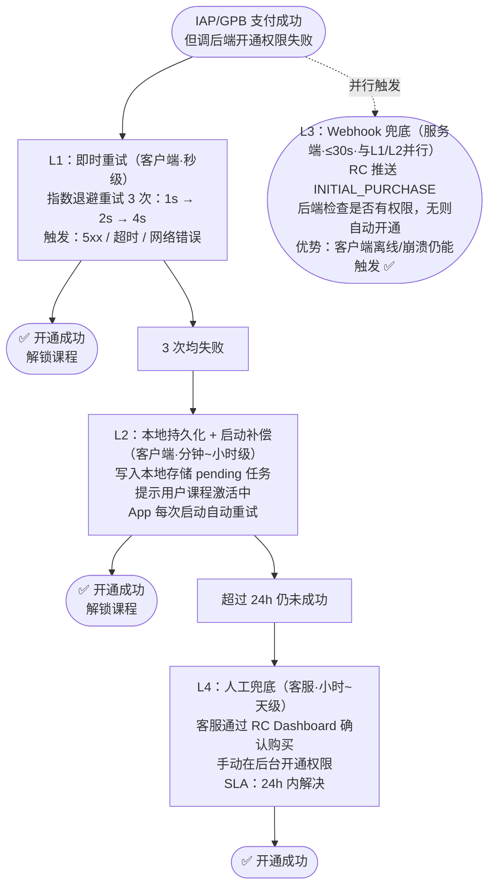


**各层防线对照表：**


| 层级            | 触发条件    | 执行方 | 延迟    | 成功率预估            | 用户感知          |
| ------------- | ------- | --- | ----- | ---------------- | ------------- |
| L1 即时重试       | 后端调用失败  | 客户端 | 1~7s  | 95%+ (通常是瞬时网络抖动) | 多等几秒          |
| L2 启动补偿       | L1 全部失败 | 客户端 | 分钟~小时 | 99%+ (等后端恢复)     | 提示"激活中"，重启后可用 |
| L3 Webhook 兜底 | RC 推送事件 | 服务端 | ≤30s  | 99.9% (独立链路)     | 无感知（后台自动）     |
| L4 人工兜底       | 用户联系客服  | 客服  | 小时~天  | 100%             | 需主动联系         |


**伪代码实现：**

```typescript
async function handlePurchaseSuccess(customerInfo, storeTransaction) {
  const grantPayload = {
    user_id:        getCurrentUserId(),
    course_id:      "yoga_ball_course",
    source:         storeTransaction.store === "APP_STORE" ? "iap" : "gpb",
    transaction_id: storeTransaction.transactionIdentifier,
    product_id:     storeTransaction.productIdentifier,
    store:          storeTransaction.store,
    purchase_date:  storeTransaction.purchaseDate,
  };

  // L1: 即时重试
  const maxRetries = 3;
  for (let i = 0; i < maxRetries; i++) {
    try {
      const result = await api.post("/course/entitlement/grant", grantPayload);
      if (result.success) {
        clearPendingGrant();             // 清除本地待开通任务
        updateLocalCourseAccess(true);   // 更新本地缓存
        navigateToSuccessPage();
        return;
      }
    } catch (error) {
      if (i < maxRetries - 1) {
        await sleep(Math.pow(2, i) * 1000);  // 指数退避: 1s, 2s, 4s
      }
    }
  }

  // L2: L1 全部失败 → 持久化到本地
  savePendingGrant(grantPayload);
  showActivatingMessage();
  // "Payment successful! Course is being activated..."
}

// App 启动时自动检查
async function checkPendingGrants() {
  const pending = loadPendingGrant();
  if (!pending) return;

  // 超过 24h 的任务不再自动重试，引导联系客服
  if (Date.now() - pending.created_at > 24 * 60 * 60 * 1000) {
    showContactSupportMessage(pending.transaction_id);
    return;
  }

  try {
    const result = await api.post("/course/entitlement/grant", pending);
    if (result.success) {
      clearPendingGrant();
      updateLocalCourseAccess(true);
      showCourseUnlockedToast();
    }
  } catch (error) {
    // 静默失败，下次启动继续
  }
}
```

**后端防重放和幂等性：**

```
function grantCourseEntitlement(request):
    // 1. 验证 JWT 身份
    if request.user_id != jwt.user_id:
        return 403

    // 2. 幂等：检查 transaction_id 是否已处理
    existing = db.query("SELECT * FROM course_grant_log
                         WHERE transaction_id = ?", request.transaction_id)
    if existing:
        return { success: true, course_access: existing.result }  // 幂等返回

    // 3. 开通权限
    courseEntitlementService.grant(request.user_id, request.course_id)

    // 4. 记录日志（含 transaction_id 用于幂等）
    db.insert("course_grant_log", {
        user_id: request.user_id,
        course_id: request.course_id,
        transaction_id: request.transaction_id,
        source: request.source,
        granted_at: now()
    })

    return { success: true, course_access: { ... } }
```

> 幂等性保证：L1 重试、L2 启动补偿、L3 Webhook 兜底可能对同一笔交易多次调用，后端通过 `transaction_id` 去重，确保不重复开通、不报错。

#### F5: 权益验证与门控

> 课程权益验证走现有后端系统，不走 RevenueCat。

**客户端门控实现：**

```
// 课程权益 — 使用现有后端 API（接口格式待调研）
function hasCourseAccess(courseId: string): boolean {
    const courseEntitlements = getCachedCourseEntitlements();
    return courseEntitlements.some(c => c.courseId === courseId && c.hasAccess);
}

if (hasCourseAccess("yoga_ball_course")) {
    // 解锁：显示课程视频播放器
} else {
    // 锁定：显示购买引导页
}
```

**服务端验权：**

```
function verifyCourseAccess(userId, courseId):
    return courseEntitlementService.checkAccess(userId, courseId)
```

#### F6: 恢复购买

**入口位置：**

- 设置页 > "Restore Purchases"
- 课程商店页底部小字入口："Already purchased? Restore"

**处理流程（课程场景 — PRD-1）：**

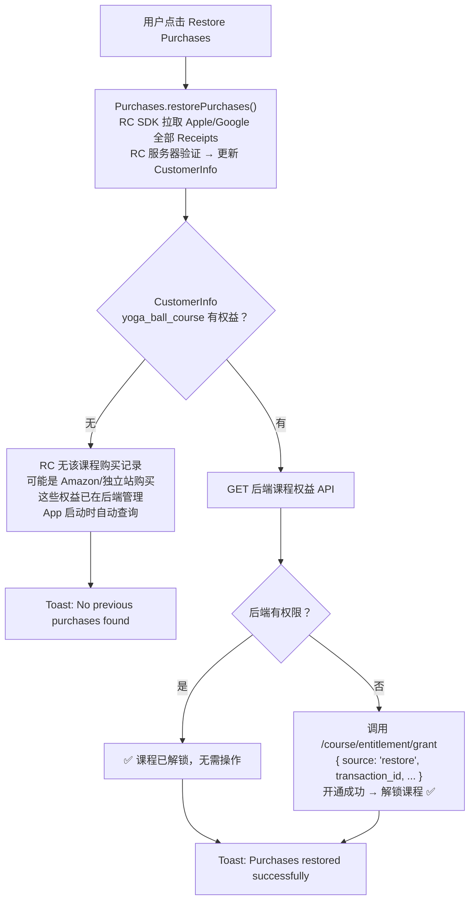


> **注意**：课程在 Amazon/独立站购买的用户，不需要也无法通过 Restore Purchases 恢复。这些权益在现有后端系统中已存在，App 启动时查后端课程权益 API 即可获取。

**PRD-2 扩展（订阅场景）：** 订阅权益由 RC 管理，`restorePurchases()` 返回的 `CustomerInfo` 即为权威来源。`entitlements.active["storage_pro"].isActive == true` 则直接解锁，无需额外调后端。

**UI 反馈：**


| 结果          | Toast                               |
| ----------- | ----------------------------------- |
| 恢复成功（课程或订阅） | "Purchases restored successfully"   |
| 无可恢复购买      | "No previous purchases found"       |
| 网络/SDK 错误   | "Restore failed. Please try again." |
| 恢复过程中       | Loading 状态，禁止重复点击                   |


> **F6a 我的购买页面** 已移至 PRD-2 统一规划（同时展示课程 + 订阅的购买记录）。

#### F6b: 迁移用户首次登录引导

**触发条件**：用户登录 → 查询后端课程权益 API → 有权益 + 来源为非 App 渠道 → 本地标记未展示 → 触发弹窗

```
┌──────────────────────────────────┐
│           ✨                      │
│                                  │
│   Your Yoga Ball Course          │
│   is ready!                      │
│                                  │
│   You can now watch the full     │
│   course directly in the app.    │
│                                  │
│   ┌────────────────────────────┐ │
│   │     [ Go to Course → ]    │ │
│   └────────────────────────────┘ │
│                                  │
│              [ Maybe Later ]     │
│                                  │
└──────────────────────────────────┘
```


| 规则           | 说明                     |
| ------------ | ---------------------- |
| 展示时机         | 登录后 1-2 秒延迟展示          |
| 展示次数         | 仅一次                    |
| Go to Course | 跳转课程详情页                |
| Maybe Later  | 关闭弹窗，不再展示              |
| 弹窗类型         | 非阻塞式底部弹窗（Bottom Sheet） |


### 6.3 后端功能详述

#### F7: Webhook 接收与处理


| 项目           | 详情                                |
| ------------ | --------------------------------- |
| URL          | `POST /api/v1/revenuecat/webhook` |
| Content-Type | application/json                  |
| 认证方式         | Authorization Header（预共享 Token）   |


**需处理的事件类型（PRD-1 范畴）：**


| 事件                 | 业务处理  | 本地数据操作                                                             | 备注                                         |
| ------------------ | ----- | ------------------------------------------------------------------ | ------------------------------------------ |
| `INITIAL_PURCHASE` | 课程首购  | INSERT rc_webhook_events + **L3 兜底开通**：检查该用户是否已有课程权限，如无则调用课程权益开通接口 | 主链路为客户端 L1 即时调用，此处为异常情况兜底                  |
| `REFUND`           | 课程退款  | INSERT rc_webhook_events + **通知现有课程权益系统撤销权限**                      | 退款事件存入 rc_webhook_events，无需独立 refund_log 表 |
| `SUBSCRIBER_ALIAS` | ID 别名 | UPDATE user_alias_mapping                                          |                                            |


> PRD-2 上线后，此 Webhook 端点将新增 RENEWAL / CANCELLATION / EXPIRATION / BILLING_ISSUE 等订阅事件处理。

**安全 & 可靠性：**


| 要求   | 实现方式                                                |
| ---- | --------------------------------------------------- |
| 认证   | 比对 Authorization Header 与预配置 Token                  |
| 幂等   | 以 event.id 为唯一键，INSERT 前检查 processed_events 表       |
| 重试兼容 | RevenueCat 重试间隔为 5s → 10s → 30s → 1min → 5min → ... |
| 超时   | 接口响应 ≤ 5s                                           |
| 响应码  | 成功 200；认证失败 401；异常 500（触发重试）                        |


#### F8: 购买日志同步

Webhook 事件写入以下表：

- `**rc_webhook_events`（审计日志，原始完整记录）** — MVP 必建
- `**course_grant_log`（课程权益开通日志）** — MVP 必建（幂等 + 异常排查）
- ~~`purchase_log`（业务流水）~~ — **已移至 PRD-2**，随"我的购买"页面一起规划。原始数据保存在 `rc_webhook_events.raw_payload` 中，PRD-2 开发时可回溯提取

`**rc_webhook_events` 表 — Webhook 原始事件（审计日志）**

存储 RevenueCat 推送的全部原始事件，用于问题排查、对账和审计。每条 Webhook 请求原样记录，不做业务加工。


| 字段                | 类型                              | 说明                                                                                                                                  |
| ----------------- | ------------------------------- | ----------------------------------------------------------------------------------------------------------------------------------- |
| id                | BIGINT AUTO_INCREMENT           | 自增主键                                                                                                                                |
| rc_event_id       | VARCHAR(64) UNIQUE              | RevenueCat 事件唯一 ID（幂等键，用于去重）                                                                                                        |
| event_type        | VARCHAR(32) NOT NULL            | 事件类型：INITIAL_PURCHASE / RENEWAL / CANCELLATION / EXPIRATION / BILLING_ISSUE / REFUND / PRODUCT_CHANGE / SUBSCRIBER_ALIAS / TRANSFER |
| app_user_id       | VARCHAR(128)                    | 品牌用户 ID                                                                                                                             |
| product_id        | VARCHAR(128)                    | 产品 SKU（如 yoga_ball_course_iap）                                                                                                      |
| entitlement_id    | VARCHAR(64)                     | 权益 ID（如 yoga_ball_course）                                                                                                           |
| price             | DECIMAL(10,2)                   | 交易金额（0 表示试用/退款/迁移）                                                                                                                  |
| currency          | VARCHAR(3)                      | 货币代码（USD / GBP / EUR 等）                                                                                                             |
| platform          | VARCHAR(16)                     | ios / android / stripe                                                                                                              |
| country_code      | VARCHAR(2)                      | 用户所在国家（US / GB / FR 等）                                                                                                              |
| environment       | VARCHAR(16) NOT NULL            | sandbox / production（区分测试和生产）                                                                                                       |
| event_timestamp   | DATETIME NOT NULL               | 事件在 Apple/Google 实际发生的时间                                                                                                            |
| received_at       | DATETIME NOT NULL DEFAULT NOW() | 后端接收到 Webhook 的时间                                                                                                                   |
| raw_payload       | TEXT NOT NULL                   | 原始 JSON body（完整保留，用于问题排查）                                                                                                           |
| processing_status | VARCHAR(16) DEFAULT 'processed' | processed / failed / skipped                                                                                                        |
| processing_note   | VARCHAR(256)                    | 处理结果备注（如失败原因）                                                                                                                       |


**索引建议：**

- UNIQUE INDEX on `rc_event_id`（幂等去重）
- INDEX on `app_user_id`（按用户查询）
- INDEX on `event_type, event_timestamp`（按类型+时间范围查询）
- INDEX on `environment`（区分 sandbox/production）

> `**purchase_log` 表** 已移至 PRD-2，随"我的购买"页面一起规划。表结构详见 PRD-2 文档。

`**course_grant_log` 表 — 课程权益开通日志**

记录每次课程权益开通请求（由客户端 L1/L2 或 Webhook L3 触发），用于幂等控制和问题排查。


| 字段             | 类型                              | 说明                                               |
| -------------- | ------------------------------- | ------------------------------------------------ |
| id             | BIGINT AUTO_INCREMENT           | 自增主键                                             |
| app_user_id    | VARCHAR(128) NOT NULL           | 品牌用户 ID                                          |
| course_id      | VARCHAR(64) NOT NULL            | 课程 ID（yoga_ball_course）                          |
| transaction_id | VARCHAR(128) NOT NULL           | Apple/Google 交易 ID（幂等键）                          |
| source         | VARCHAR(16) NOT NULL            | 触发来源：client_l1 / client_l2 / webhook_l3 / manual |
| product_id     | VARCHAR(128)                    | 产品 SKU                                           |
| store          | VARCHAR(16)                     | APP_STORE / PLAY_STORE                           |
| grant_result   | VARCHAR(16) NOT NULL            | success / already_granted / failed               |
| error_message  | VARCHAR(256)                    | 失败时的错误信息                                         |
| granted_at     | DATETIME NOT NULL DEFAULT NOW() | 开通时间                                             |


**索引建议：**

- UNIQUE INDEX on `transaction_id`（幂等，同一笔交易只开通一次）
- INDEX on `app_user_id`（按用户查询开通历史）

**两张表的关系：**

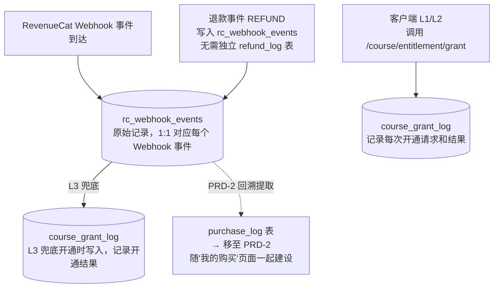


> **PRD-1 建表方案**：`rc_webhook_events` + `course_grant_log` 两张表支撑支付 + 权益开通核心链路。`purchase_log` 在 PRD-2 中随"我的购买"页面一起建设，届时可从 `rc_webhook_events.raw_payload` 回溯补录 PRD-1 阶段的历史数据。

> **F9 购买记录查询 API** 已移至 PRD-2，随"我的购买"页面和 `purchase_log` 表一起规划。

#### F10: 退款联动处理

收到 REFUND Webhook 后：

1. 记录退款日志
2. 调用现有课程权益系统撤销该用户该课程的权限
3. 撤销失败则告警，人工介入

**待调研**：现有系统是否有撤销权限的接口。

#### F11: 数据同步脚本

批量调用 RevenueCat REST API `grant_promotional` 接口，将 ≤100 名历史已购用户的购买记录同步至 RC Dashboard。

### 6.4 RevenueCat Dashboard 运营功能

#### F12: 产品配置

- 创建 Entitlement: `yoga_ball_course`
- 关联 iOS/Android Product
- 创建 Offering: `default`，包含课程 Package

#### F13: 数据看板


| 指标          | 定义             |
| ----------- | -------------- |
| Revenue     | 课程购买总收入        |
| 购买量         | 按日/周/月         |
| 按平台拆分       | iOS vs Android |
| 按地区拆分       | 9 个市场各自的数据     |
| Refund Rate | 退款率            |


#### F14: 用户管理

- 搜索用户（App User ID）查看购买历史
- Grant Promotional Entitlement（客服为迁移遗漏用户补授权）
- Revoke Promotional Entitlement（撤销误授）

---

## 7. 数据埋点需求

### 7.1 商店与产品浏览


| 事件名                          | 触发时机      | 属性                                  |
| ---------------------------- | --------- | ----------------------------------- |
| `store_page_viewed`          | 进入数字产品商店页 | `source`                            |
| `product_card_clicked`       | 点击产品卡片    | `product_id`, `product_type`        |
| `course_detail_viewed`       | 进入课程详情页   | `course_id`, `source`               |
| `course_preview_played`      | 播放预览视频    | `course_id`, `preview_duration_sec` |
| `course_curriculum_expanded` | 展开课程大纲    | `course_id`                         |


### 7.2 购买流程


| 事件名                       | 触发时机       | 属性                                                              |
| ------------------------- | ---------- | --------------------------------------------------------------- |
| `purchase_initiated`      | 点击购买按钮     | `product_id`, `price`, `currency`, `platform`                   |
| `payment_sheet_presented` | 原生支付面板弹出   | `product_id`, `platform`                                        |
| `purchase_completed`      | 支付成功+权益已激活 | `product_id`, `price`, `currency`, `platform`, `transaction_id` |
| `purchase_cancelled`      | 用户取消支付     | `product_id`, `platform`                                        |
| `purchase_failed`         | 支付失败       | `product_id`, `platform`, `error_code`                          |
| `purchase_restored`       | 恢复购买       | `restored_count`                                                |


### 7.3 权益与内容访问


| 事件名                   | 触发时机         | 属性                                      |
| --------------------- | ------------ | --------------------------------------- |
| `entitlement_checked` | App 启动或页面切换时 | `entitlement_id`, `is_active`, `source` |
| `content_unlocked`    | 访问受保护内容      | `entitlement_id`, `content_id`          |
| `paywall_shown`       | 展示购买引导       | `entitlement_id`, `content_id`          |
| `paywall_cta_tapped`  | 点击购买 CTA     | `entitlement_id`, `product_id`          |
| `paywall_dismissed`   | 关闭购买引导       | `entitlement_id`                        |


### 7.4 数据迁移用户


| 事件名                            | 触发时机             | 属性                                |
| ------------------------------ | ---------------- | --------------------------------- |
| `migration_welcome_shown`      | 迁移用户展示欢迎弹窗       | `user_id`, `migrated_entitlement` |
| `migration_welcome_cta_tapped` | 点击"Go to Course" | `user_id`                         |
| `migration_welcome_dismissed`  | 关闭欢迎弹窗           | `user_id`                         |


### 7.5 后端 Webhook 日志

所有 Webhook 事件写入 `rc_webhook_events` 表（详见 6.3 节 F8）。`purchase_log` 表为可延后项，MVP 阶段可不建。

### 7.6 关键分析看板


| 看板名         | 核心指标                     | 数据来源         |
| ----------- | ------------------------ | ------------ |
| **购买漏斗**    | 商店浏览 → 详情页 → 发起购买 → 完成购买 | 客户端埋点        |
| **收入概览**    | Revenue、按平台/地区拆分         | RC Dashboard |
| **Paywall** | 展示次数、CTA 点击率、转化率         | 客户端埋点        |
| **迁移监控**    | 迁移用户登录率、课程访问率、引导弹窗交互率    | 客户端埋点        |


---

## 8. 非功能需求

### 8.1 性能要求


| 指标           | 目标值                |
| ------------ | ------------------ |
| SDK 初始化      | ≤ 2s（冷启动）          |
| Offerings 加载 | ≤ 1s               |
| 购买流程端到端      | ≤ 10s（含原生支付面板时间除外） |
| 课程权益验证（在线）   | ≤ 500ms            |
| 课程权益验证（缓存）   | ≤ 50ms             |
| Webhook 处理   | ≤ 5s               |
| 后端 API 响应    | ≤ 200ms (P99)      |


### 8.2 可用性与可靠性


| 指标               | 目标值                           |
| ---------------- | ----------------------------- |
| 后端 Webhook 端点可用性 | 99.9%                         |
| 降级策略             | RC 不可用时购买暂不可用；课程权益不受影响（走现有系统） |
| 离线能力             | 基于本地缓存权益 + 已下载课程视频，离线可继续观看    |


### 8.3 安全要求


| 维度            | 要求                                |
| ------------- | --------------------------------- |
| 通信加密          | 全链路 HTTPS，TLS 1.2+                |
| Webhook 认证    | 验证 Authorization Header Token     |
| API Key 分级管理  | Public Key（客户端）vs Secret Key（服务端） |
| Secret Key 存储 | 环境变量或密钥管理服务，不硬编码                  |
| Receipt 验证    | 服务端验证（RevenueCat 自动处理）            |
| 支付信息          | 品牌侧不存储任何支付卡号信息                    |


### 8.4 合规要求


| 要求                                    | 影响           |
| ------------------------------------- | ------------ |
| 数字内容使用 IAP 支付（Apple Guidelines 3.1.1） | iOS 审核       |
| 数字内容使用 GPB 支付                         | Android 审核   |
| GDPR / CCPA 合规                        | 用户隐私         |
| UAE/KSA 数字商品法规                        | 中东市场         |
| 提供 "Restore Purchases" 按钮             | Apple 审核硬性要求 |
| 展示 Terms of Service + Privacy Policy  | 双端审核         |
| App 内不展示非 IAP 购买入口                    | 合规要求         |
| Non-consumable 不提供重复购买入口              | 合规要求         |


### 8.5 国际化


| 维度    | 方案                                                         |
| ----- | ---------------------------------------------------------- |
| 价格本地化 | App Store Connect / Google Play Console 配置，RevenueCat 自动返回 |
| 货币展示  | 使用 SDK 返回的 `localizedPriceString`                          |
| UI 语言 | 仅英文                                                        |
| 税务    | Apple/Google 自动处理各市场 VAT/GST                               |


**9 市场定价参考矩阵：**


| 市场  | 货币  | 课程参考价  |
| --- | --- | ------ |
| US  | USD | $49.99 |
| CA  | CAD | $64.99 |
| UK  | GBP | £39.99 |
| FR  | EUR | €49.99 |
| DE  | EUR | €49.99 |
| IT  | EUR | €49.99 |
| ES  | EUR | €49.99 |
| AE  | AED | 179.99 |
| SA  | SAR | 189.99 |


### 8.6 监控与告警


| 监控项           | 告警条件            | 通知方式              |
| ------------- | --------------- | ----------------- |
| Webhook 端点不可用 | 连续 5 分钟无法响应     | Slack + PagerDuty |
| 购买成功率下降       | 低于 90%（滚动 1 小时） | Slack             |
| Webhook 处理失败率 | 高于 5%           | Slack             |
| SDK 初始化失败率    | 高于 5%           | Slack             |
| 课程权益开通失败      | 任何一次（P0）        | Slack + PagerDuty |


---

## 9. 上线运营策略

### 9.1 上线前准备


| 项目                           | 责任方      | 完成时间    |
| ---------------------------- | -------- | ------- |
| Apple/Google 审核合规自查          | 产品 + 客户端 | 提审前 1 周 |
| 运营团队 RevenueCat Dashboard 培训 | 技术 → 运营  | M5 前    |
| 客服团队 FAQ 培训（购买失败、退款、恢复购买）    | 产品 → 客服  | M5 前    |
| 隐私政策更新（增加 RevenueCat 数据处理说明） | 法务 + 产品  | 提审前     |
| Terms of Service 更新          | 法务 + 产品  | 提审前     |
| 课程内容上传至 CDN 并验证              | 内容 + 后端  | M2 前    |


### 9.2 灰度发布策略


| 阶段   | 覆盖比例   | 时长  | 观测指标              | 通过标准               |
| ---- | ------ | --- | ----------------- | ------------------ |
| 灰度 1 | 5% 用户  | 3 天 | 购买成功率、崩溃率、SDK 错误率 | 成功率 ≥ 95%，无 P0 bug |
| 灰度 2 | 20% 用户 | 3 天 | 同上 + Webhook 处理   | Webhook 100%       |
| 灰度 3 | 50% 用户 | 3 天 | 同上 + 购买转化率        | 转化率不低于预期的 70%      |
| 全量发布 | 100%   | —   | 全部指标              | 稳定运行               |


**回滚条件**：购买成功率 < 85% / SDK 崩溃率 > 0.5% / Webhook 失败率 > 10% / 出现权益泄漏或误封

### 9.3 已购用户通知策略


| 触达方式      | 时机                   | 内容                                         |
| --------- | -------------------- | ------------------------------------------ |
| App Push  | 数据同步完成后用户首次打开 App 时  | "Your Yoga Ball Course is now in the app!" |
| 邮件通知      | 同步完成后 1 天            | 告知课程已在 App 中激活，引导下载/打开 App                 |
| App 内引导弹窗 | 用户首次登录 App 时（US-202） | 欢迎弹窗 + 直达课程入口                              |


### 9.4 客服预案


| 场景         | 处理方式                                                               |
| ---------- | ------------------------------------------------------------------ |
| 购买成功但课程未解锁 | 1) 确认 User ID；2) 检查现有系统权益状态；3) 无权益→手动调用开通接口；4) RC Dashboard 确认购买记录 |
| 用户要求退款     | 引导用户通过 Apple/Google 官方渠道                                           |
| 跨平台无法访问    | 1) 确认两端登录同一账号；2) 引导"恢复购买"；3) 检查后端权益                                |
| 迁移用户课程未激活  | 1) 确认在迁移名单中；2) 检查现有系统权益；3) 不在名单→补充授权                               |


---

## 10. 前置配置事项

### 10.1 App Store Connect 配置


| 步骤  | 操作                                                          | 输出              |
| --- | ----------------------------------------------------------- | --------------- |
| 1   | 创建 Non-Consumable IAP：`yoga_ball_course_iap`                | Product ID      |
| 2   | 配置 9 市场本地化价格                                                | 价格表             |
| 3   | 填写 Display Name、Description                                 | 文案              |
| 4   | 生成 App-Specific Shared Secret                               | Secret          |
| 5   | 创建 App Store Connect API Key（用于 RC Server Notifications V2） | Key ID + .p8 文件 |
| 6   | 添加 Sandbox Tester 账号                                        | 测试账号            |


### 10.2 Google Play Console 配置


| 步骤  | 操作                                                 | 输出                    |
| --- | -------------------------------------------------- | --------------------- |
| 1   | 创建 In-app Product（One-time）：`yoga_ball_course_gpb` | Product ID            |
| 2   | 配置 9 市场本地化价格                                       | 价格表                   |
| 3   | 创建 Google Cloud Service Account                    | Service Account Email |
| 4   | 授予 "Financial Data" + "Manage Orders" 权限           | 权限配置                  |
| 5   | 导出 Service Account JSON Key                        | JSON 文件               |
| 6   | 激活 Google Play Developer API                       | API 已启用               |
| 7   | 添加 License Test 账号                                 | 测试账号                  |


### 10.3 RevenueCat Dashboard 配置


| 步骤  | 操作                                                 | 前置条件      |
| --- | -------------------------------------------------- | --------- |
| 1   | 创建 Project                                         | RC 账号     |
| 2   | 添加 iOS App，上传 API Key                              | 10.1 完成   |
| 3   | 添加 Android App，上传 Service Account JSON             | 10.2 完成   |
| 4   | 创建 Entitlement: `yoga_ball_course`                 | —         |
| 5   | 导入 iOS/Android Products                            | 10.1+10.2 |
| 6   | 关联 Products → Entitlements                         | Step 4-5  |
| 7   | 创建 Offering: `default`，添加课程 Package                | Step 5    |
| 8   | 配置 Webhook：填写后端 URL + Authorization Token          | 后端部署      |
| 9   | 记录 Public API Key (iOS) 和 Public API Key (Android) | 给客户端      |
| 10  | 记录 Secret API Key                                  | 给后端       |


> PRD-2 阶段将新增 `storage_pro` Entitlement、subscription Products、和 Stripe 集成。

---

## 11. 风险与缓解方案


| #   | 风险                                | 影响                 | 概率  | 严重度 | 缓解策略                                     |
| --- | --------------------------------- | ------------------ | --- | --- | ---------------------------------------- |
| R1  | **Apple/Google 审核拒绝** — 产品描述不合规   | 上线延期 1-2 周         | 中   | 高   | 提前对照 Guidelines 逐条自查；排期预留 2 次审核 buffer   |
| R2  | **RevenueCat 服务中断** — 用户无法完成购买    | 短期收入损失             | 低   | 高   | 购买失败提示重试；课程权益在现有系统不受影响；监控告警              |
| R3  | **数据同步 User ID 不匹配** — 部分用户无对应记录  | RC Dashboard 数据不完整 | 低   | 低   | 迁移前 100% 校验；不匹配的人工处理                     |
| R4  | **中东市场 (UAE/KSA) 合规差异**           | 局部市场延迟上线           | 中   | 中   | 提前调研；可先上线成熟市场                            |
| R5  | **RN + Native 混合架构 SDK 初始化冲突**    | 购买异常               | 中   | 高   | 严格在原生层单点初始化；RN 层不重复 configure            |
| R6  | **课程权益开通失败** — IAP 支付成功但调后端开通权限失败 | 用户付款但无法访问课程        | 低   | 高   | 客户端重试 3 次；App 启动补偿检查；Webhook 兜底；客服手动处理通道 |
| R7  | **Webhook 丢失或延迟** — 购买日志未及时记录     | 对账数据不一致            | 低   | 中   | RC 自动重试；定期对账脚本                           |


---

## 12. 成功指标

### 12.1 上线验证指标（Go/No-Go）


| 指标            | 目标     | Go 标准 |
| ------------- | ------ | ----- |
| 课程购买成功率       | ≥ 95%  | 必须达标  |
| 权益验证准确率       | 100%   | 必须达标  |
| App 审核通过      | 双端通过   | 必须达标  |
| Webhook 处理成功率 | ≥ 99%  | 必须达标  |
| SDK 崩溃率       | ≤ 0.1% | 必须达标  |


### 12.2 上线后业务指标（首 3 个月）


| 指标        | 目标值         | 优化方向              |
| --------- | ----------- | ----------------- |
| 课程详情页访问量  | ≥ 1000 UV/月 | 商店入口曝光、Banner 推广  |
| 课程购买转化率   | ≥ 2%        | 详情页优化、CTA 文案、预览视频 |
| 支付相关客诉率   | ≤ 0.5%      | 错误处理体验、客服 SOP     |
| 迁移用户课程激活率 | ≥ 80%       | 推送通知、引导弹窗         |


---

## 附录

### A. Apple 审核 Checklist

- 数字内容使用 IAP 支付（Guidelines 3.1.1）
- 提供 "Restore Purchases" 按钮且功能正常
- 展示 Terms of Service 和 Privacy Policy 链接
- Privacy Policy 中包含 RevenueCat 作为数据处理方的说明
- App 内不展示非 IAP 的购买入口
- Non-consumable 不提供重复购买入口

### B. Google Play 审核 Checklist

- 数字内容使用 GPB 支付
- 使用 Google Play Billing Library 最新稳定版
- 在 Google Play Console 正确配置 Service Account 权限

### C. RevenueCat 关键文档


| 文档               | 链接                                                                                                                                                                                                     |
| ---------------- | ------------------------------------------------------------------------------------------------------------------------------------------------------------------------------------------------------ |
| RevenueCat 官方文档  | [https://www.revenuecat.com/docs](https://www.revenuecat.com/docs)                                                                                                                                     |
| iOS SDK 集成       | [https://www.revenuecat.com/docs/getting-started/installation/ios](https://www.revenuecat.com/docs/getting-started/installation/ios)                                                                   |
| Android SDK 集成   | [https://www.revenuecat.com/docs/getting-started/installation/android](https://www.revenuecat.com/docs/getting-started/installation/android)                                                           |
| React Native SDK | [https://www.revenuecat.com/docs/getting-started/installation/reactnative](https://www.revenuecat.com/docs/getting-started/installation/reactnative)                                                   |
| REST API v1      | [https://www.revenuecat.com/docs/api-v1](https://www.revenuecat.com/docs/api-v1)                                                                                                                       |
| Webhooks         | [https://www.revenuecat.com/docs/integrations/webhooks](https://www.revenuecat.com/docs/integrations/webhooks)                                                                                         |
| 授予促销权益           | [https://www.revenuecat.com/docs/api-v1#tag/Entitlements/operation/grant-a-promotional-entitlement](https://www.revenuecat.com/docs/api-v1#tag/Entitlements/operation/grant-a-promotional-entitlement) |
| Offering 远程配置    | [https://www.revenuecat.com/docs/offerings](https://www.revenuecat.com/docs/offerings)                                                                                                                 |


### D. 待确认事项清单


| #   | 事项                                         | 决策方     | 状态      |
| --- | ------------------------------------------ | ------- | ------- |
| 1   | 9 市场的本地化课程定价确认                             | 产品      | 待定      |
| 2   | 课程预览视频片段的选取                                | 内容      | 待定      |
| 3   | 灰度发布的用户分组策略                                | 产品+技术   | 待定      |
| 4   | RevenueCat 账号等级选择（Free / Pro / Enterprise） | 技术+财务   | 待定      |
| 5   | 已购用户通知邮件内容与发送时间                            | 运营      | 待定      |
| 6   | ⚠️ 现有课程权益查询接口格式（URL、请求/响应结构）               | **后端**  | **待调研** |
| 7   | ⚠️ 现有课程权益开通接口格式（URL、参数、鉴权）                 | **后端**  | **待调研** |
| 8   | ⚠️ App 当前判断课程权益的方式（调接口 or 本地状态）            | **客户端** | **待调研** |
| 9   | ⚠️ 现有系统是否有撤销权限接口（用于退款联动）                   | **后端**  | **待调研** |


### E. PRD-2 预留接口

PRD-1 建设的基础设施在 PRD-2 中将被扩展：


| PRD-1 交付物                        | PRD-2 扩展                                  |
| -------------------------------- | ----------------------------------------- |
| SDK 初始化 + logIn                  | 新增订阅产品的购买和权益管理                            |
| Webhook 端点（处理课程事件）               | 新增 RENEWAL / CANCELLATION / EXPIRATION 等  |
| Offering: `default`（仅课程 Package） | 新增 monthly / yearly Package               |
| 商店页（课程 + Coming Soon 占位）         | 替换 Coming Soon 为真实订阅入口                    |
| rc_webhook_events 表（原始事件）        | 复用，新增订阅事件写入                               |
| 无 purchase_log 表                 | 新增 purchase_log 表 + 购买记录查询 API + 我的购买页面   |
| 无 user_subscription 表            | 新增 user_subscription + user_entitlement 表 |


---

*文档结束 — PRD-1 v1.2 — 如有疑问请联系产品负责人*